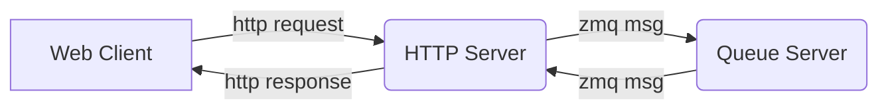

# Ophyd API
A Bluesky web interface built with React, Python FastAPI, Bluesky, OPHYD, PV Web Socket.


<div style="width: fit-content; border-style:solid; padding-right:40px; padding-top: 20px; padding-bottom: 20px; border-radius: 5px; margin-bottom:20px;">

<h2 style="margin: auto; text-align:center; border-bottom: none">Contents</h2>

- [User Setup](#user-setup)
  - [Required: Install PV Web Scoket](#isntall-pv-web-socket)
  - [Required: Run Application](#run-application)
  - [Optional: Run EPICS-Docker](#run-epics-docker)
    - [Use Image Directly](#use-image-directly)
    - [Use EPICS-docker start script](#use-epics-docker-start-scripts)
- [Developer Setup](#developer-setup)
  - [PV Web Socket](#pv-web-socket)
  - [Python Server](#python-server)
    - [Python Server in Container](#python-server-in-container)
  - [React Frontend](#react-frontend)
    - [React Development Scripts](#react-development-scripts)
- [EPICS-Docker IOC setup](#epics-docker-ioc-setup)
    - [Running motorMotorSim IOC](#running-motormotorsim-ioc)
    - [Running custom GP IOC](#running-custom-gp-ioc)
- [Mac Developer Notes](#mac-developer-notes)

</div>

# User Setup
A docker-compose file is used to run the required services together. For full functionality, the host computer should be running an EPICS IOC or connected to one through the local network. If an existing EPICS IOC is not running, then use the script that starts EPICS.

## Install PV Web Socket
From the top level repo directory, clone the following repository which is used to provide live PV updates.

```
git clone https://github.com/ornl-epics/pvws.git
```

Now edit the environment variables in `pvws/docker/setenv.sh`

At a minimum, uncomment PV_WRITE_SUPPORT and set to true as shown below.
```
## ----- pvws/docker/setenv.sh  ----- ##

# Web Socket Settings
#export PV_DEFAULT_TYPE=ca
#export PV_THROTTLE_MS=1000
#export PV_ARRAY_THROTTLE_MS=10000
export PV_WRITE_SUPPORT=true # <------ This must be set to true

# Channel Access Settings
#export EPICS_CA_ADDR_LIST=localhost
#export EPICS_CA_MAX_ARRAY_BYTES=1000000

# PV Access Settings
#export EPICS_PVA_ADDR_LIST=localhost
#export EPICS_PVA_AUTO_ADDR_LIST=YES
#export EPICS_PVA_BROADCAST_PORT=5076
#export EPICS_PVA_NAME_SERVERS=
```


If you already have a running instance of EPICS on a computer and use custom EPICS environment variables, then edit the other environment variables for PVWS as required. 

More information on simulated PV's that can be subscribed to by PVWS can be found [`here`](https://control-system-studio.readthedocs.io/en/latest/core/pv/doc/index.html)

## Run Application
Two different scripts are provided that will start the application in docker containers. The first script starts the main services (frontend, python server, PV Web Socket). The second script will start the same services and also run a container with EPICS. 

If you already have EPICS running and want to access your own IOCs, use the first script. Otherwise the second script can be used to start a "default" EPICS environment that still works with the application.

<mark>Run Application (Linux Only)</mark> \
```
#ophyd-api/
docker-compose up -d --build
```
\
<mark>Run Application + EPICS (Mac or Linux)</mark>
```
#ophyd-api/
docker-compose -f docker-compose.start-epics.yml -d --build
```
Navigate to port 8081 in a web browser to view the application

http://localhost:8081/

\
<mark>Stop Application</mark>
```
#ophyd-api/
docker-compose stop
```

## Run EPICS-Docker
To run EPICS in a container by itself, the [`prjemian/synapps`](https://hub.docker.com/r/prjemian/synapps) image can be used. This image contains EPICS base 7.0.5, synApps 6.2.1, and Area Detector 3.11. Using EPICS in a container eliminates the time investment for installing the various libraries and modules to achieve a working EPICS setup. The docker-compose.start-epics.yml file runs this image alongside the application, but it may also be useful to run EPICS separately as shown below.

See the [EPICS-Docker IOC setup](#epics-docker-ioc-setup) section for examples on starting IOCs from within the container.

### Use Image Directly
The following commands will start the prjemian/synapps image in a container. No IOC's will be started, but the user can start them by issuing commands in the container terminal.

<mark>Run EPICS-Docker (Linux Only)</mark>
```
docker run --name epics-synapps --network host -d prjemian/synapps:latest
docker exec -it epics-synapps /bin/bash
```
\
<mark>Run EPICS-Docker (Mac or Linux)</mark>
```
docker run --name epics-synapps -p 5064:5064/tcp -p 5064:5064/udp -p 5065:5065/tcp -p 5065:5065/udp -d prjemian/synapps:latest
docker exec -it epics-synapps /bin/bash
```

### Use EPICS-docker start scripts

First clone down the repo for epics-docker.
```
git clone https://github.com/prjemian/epics-docker.git
```
Within the repo are starting scripts used to run the [`prjemian/synapps`](https://hub.docker.com/r/prjemian/synapps) image which can automatically start custom IOCs. It is not required to use these startup scripts to run the image, however the scripts provide utilities such as starting and stopping IOCs which is convenient for testing purposes. 

To use the following script on a Linux machine, no additional configuration should be required so long as the Docker executable is within /usr/bin/docker.

<mark>Run EPICS-Docker with GP IOC (Linux Only)</mark>
```
./epics-docker/resources/iocmgr.sh start GP ocean
```
This command automatically starts the GP IOC in the container with prefix "ocean."


# Developer Setup
The React frontend and Python server can be run outside of containers for development ease. To allow for full functionality of the frontend, PV Web Socket should be running in its container. Additionally either the host computer or another computer on the LAN should be running EPICS. Instructions for running EPICS in a container are also provided.

## PV Web Socket
First clone PV Web Socket at the root directory.
```
git clone https://github.com/ornl-epics/pvws.git
```
Optionally set EPICS variables as required for your setup in pvws/docker/setenv.sh

Now run PV Web Socket using its provided docker file.
```
cd pvws
docker-compose up
```

To verify it is running navigate to http://localhost:8080/pvws
## Python Server
Optionally create a python environment prior to installing libraries.
```
conda create --name ophyd-api
conda activate ophyd-api
```
Install necessary dependencies.
```
pip3 install -r server/requirements.txt
```

Start the FastAPI backend Server
```
python3 server/main.py
```
### Python Server in Container
It may be more convenient to run the python server in a container if the developer is only working with the frontend. To start the Python server in a container:
```
cd server
docker build -t python-server .
docker run -dp 8080:8080 python-server
```
To run the python server and expose a port to use Jupyter Notebook (for direct Bluesky testing):
```
cd server
docker build -t python-jupyter .
docker run -it -p 8888:8888 python-jupyter /bin/bash
```
```
#in the Container Terminal
jupyter lab --ip='0.0.0.0' --port=8888 --allow-root --no-browser --ServerApp.token='' --ServerApp.password=''
```
Now in a browser you can navigate to localhost:8888/lab

## React Frontend
Install project dependencies from package.json file (only need to run the install command once).
```
npm install
```

Run the app in development mode.
```
npm start
```
Open [http://localhost:3000](http://localhost:3000) to view the app in a browser.


### React Development Scripts

```
npm test
```

Launches the test runner in the interactive watch mode.\
See the section about [running tests](https://facebook.github.io/create-react-app/docs/running-tests) for more information.

```
npm run build
```

Builds the app for production to the `build` folder.\
It correctly bundles React in production mode and optimizes the build for the best performance.

The build is minified and the filenames include the hashes.\
Your app is ready to be deployed!

See the section about [deployment](https://facebook.github.io/create-react-app/docs/deployment) for more information.

# EPICS-Docker IOC setup
The [`prjemian/synapps`](https://hub.docker.com/r/prjemian/synapps) image contains EPICS and a few custom IOCs that can be run with provided scripts. Because it comes with synApps installed, it is also fairly simple to run additional IOCs from the container via an interactive terminal.

## Running motorMotorSim IOC
The following instructions are provided as a general example for how the epics docker container can be utilized and developed in. They show the steps for running the motorMotorSim IOC.


1) Start and enter the EPICS container

`Run EPICS-Docker (Mac or Linux)`
```
docker run --name epics-synapps -p 5064:5064/tcp -p 5064:5064/udp -p 5065:5065/tcp -p 5065:5065/udp -d prjemian/synapps:latest
docker exec -it epics-synapps /bin/bash
```
\
`Run EPICS-Docker with startup scripts (Linux Only)`
```
git clone https://github.com/prjemian/epics-docker.git
./epics-docker/resources/iocmgr.sh start GP test1
docker exec -it ioctest1 sh
```
2) (All following steps are inside the container) Navigate to the motor module directory
```
screen
cd /opt/synApps/support/motor-R7-2-2/modules
```
3) (Optional) Download the updated motorMotorSim repo. The most recent version contains different PVs than that provided in the image.
```
mv motorMotorSim/ motorMotorSimOld/
git clone https://github.com/epics-motor/motorMotorSim.git
make
```

4) Edit the configuration files so that the IOC is built during Make commands
```
echo "BUILD_IOCS = YES" > motorMotorSim/configure/CONFIG_SITE.release
```

5) Run Make in the motorSimIOC directory to create the IOC.
```
cd motorMotorSim/iocs/motorSimIOC
make
```

6) Start the motorMotorSim IOC
```
cd /opt/synApps/support/motor-R7-2-2/modules/motorMotorSim/iocs/motorSimIOC/iocBoot/iocMotorSim
../../bin/linux-x86_64/motorSim st.cmd
```

7) Check the PV names (from within the EPICS terminal)
```
epics> dbl
```

## Running custom GP IOC
In the EPICS-docker container terminal, issue the commands to start GP. This command has been tested on Linux only.

```
cd $IOCGP
../../bin/linux-x86_64/gp st.cmd.Linux
```

# Mac Developer Notes
Linux machines running Docker can utilize "--network host" to map the network ports in a container to that of the host machine. This allows container services to talk to EPICS. The Mac version of Docker does not have this network host mode. Therefore some additional configuration is typically required when running any service trying to communicate with EPICS inside a container on Mac.

## EPICS Container Mac
To run the EPICS container on a Mac while providing access outside the container, the ports used for [channel access](https://epics.anl.gov/docs/CAproto.html) need to be explicitly mapped when running the container. By default, these are ports 5064 and 5065 with both UDP and TCP protocol. The ports can be manually configured within the running container if desired.

For example purposes, the following command can be used to run the [`prjemian/synapps`](https://hub.docker.com/r/prjemian/synapps) image with default Channel Access port mapping.

```
docker run -p 5064:5064/tcp -p 5064:5064/udp -p 5065:5065/tcp -p 5065:5065/udp -it prjemian/synapps:latest
```
The above command maps the 5064 and 5065 ports so that the IOC within the container can be reached from outside. This has been tested on an M2 Mac with Channel Access.


## PV Web Socket
PVWS uses "--network host" mode in its dockerfiles, so it will only work on a Linux without additional configuration. For a Mac running PVWS in Docker, the dockerfile can be modified to use the bridge mode and map port 8080. This allows use of the simulated PVs in PVWS, but does not provide the ability for PVWS to reach actual EPICS IOC's running on the host computer. To run PVWS in Docker with access to EPICS, see the next section which details how to set up a bridge network between multiple containers.

More information on simulated PV's that can be subscribed to by PVWS can be found [`here`](https://control-system-studio.readthedocs.io/en/latest/core/pv/doc/index.html)

## Running EPICS, PVWS, and Python Server together
A convenient method for developing the React App on Mac is to start everything except for the frontend in containers. This allows the use of the live server that comes with Create React App, while still having full EPICS functionality.

```
docker-compose -f docker-compose.start-epics.no-react.yml up --build
```

## Queue Server
The queue server provides a method for managing and executing Bluesky plans. Within the 
[`Queue Server Documentation`](https://blueskyproject.io/bluesky-queueserver/installation.html)

[`HTTP Server Documentation`](https://blueskyproject.io/bluesky-httpserver/installation.html)
### Installing Queue Server 
These instructions are for directly installing Queue Server outside of a container for development purposes. To run the queue server, redis will also need to be installed.

<mark>Install Redis (Mac)</mark>
```
brew update
brew install redis
brew services start redis
```
<br><br>
<mark>Install Redis (linux)</mark>
```
sudo apt-get install redis
sudo systemctl start redis
```
<br><br>
<mark>Install Python Packages</mark>

```
conda create -n queue_server python=3.10
activate queue_server
conda install bluesky-queueserver -c conda-forge
conda install bluesky-httpserver -c conda-forge
```
On testing with an M2 mac, it was found that using pyepics and ophyd installed from 'pip' resulted in errors. Only conda distributions worked.

<mark>Installing with Conda</mark>
```
conda install -c conda-forge pyepics ophyd
```

### Starting the Queue Server
<mark> Start Queue Server with Default Simulated Devices and Plans</mark>
```
start-re-manager --zmq-publish-console ON
```
<br><br>

<mark> Start Queue Server with BL5.3.1 Devices</mark>
```
#from the /ophyd-api directory

start-re-manager --zmq-publish-console ON --startup-dir /server/queue-server-configuration/startup_bl531
```
<br><br>

<mark> Publish Queue Server Console Output in a Terminal (optional)</mark>
```
qserver-console-monitor
```

### Starting the HTTP Server

<mark>Start HTTP Server with key 'test'</mark>
```
QSERVER_HTTP_SERVER_SINGLE_USER_API_KEY=test QSERVER_HTTP_SERVER_ALLOW_ORIGINS=* uvicorn --host localhost --port 60610 bluesky_httpserver.server:app
```

### Making requests via the HTTP server
The http server is a part of the queue server, it acts as a gateway to control the queue server. The queue server itself only communicates over ZMQ, so the http server acts as an API for web clients which otherwise cannot command the queue server directly. The http server is typically hosted on port 60610.



## Learn More

You can learn more in the [Create React App documentation](https://facebook.github.io/create-react-app/docs/getting-started).

<mark>sample mark</mark>


<style>
mark {
    color: white;
    background-color: #37374a;
    border-radius: 2px;
    padding: 7px 10px;
    text-shadow: black 1px 1px 2px;
}
 </style>