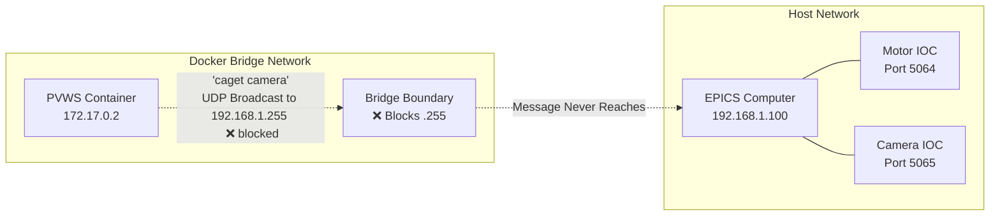
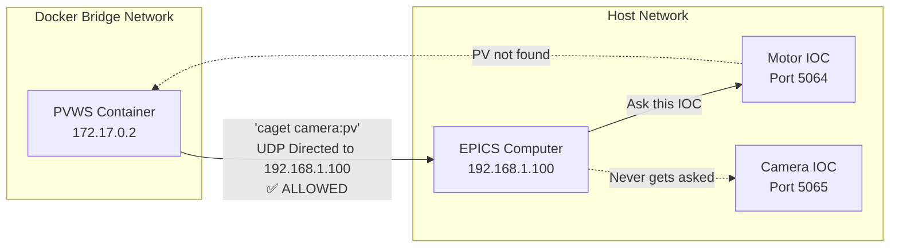
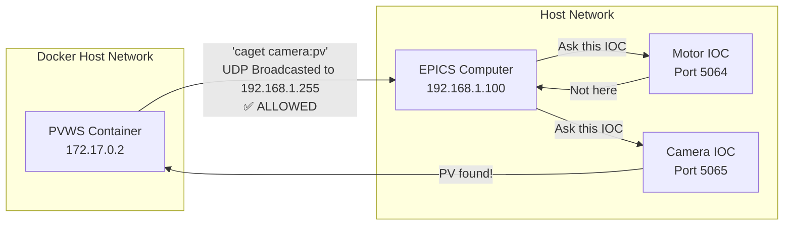

# Bluesky Web
All of the services needed to run a web-based beamline controls / data acquisition system with Bluesky. Spin everything up at once with docker-compose, or start up each service natively.


<div style="width: fit-content; border-style:solid; padding-right:40px; padding-top: 20px; padding-bottom: 20px; border-radius: 5px; margin-bottom:20px;">

<h2 style="margin: auto; text-align:center; border-bottom: none">Contents</h2>

- [Docker Compose Setup](#docker-compose-setup)

- [Individual Service Setup](#individual-service-setup)
- [EPICS-Docker IOC setup](#epics-docker-ioc-setup)

- [Mac Developer Notes](#mac-developer-notes)

</div>

# Docker Compose Setup
A docker-compose file is used to run the required services together. For full functionality, the host computer should be running an EPICS IOC or connected to one through the local network. If an existing EPICS IOC is not running, then use the script that starts EPICS.

## 1. Clone the Repository
Clone this repository with the --recurse-submodules flag.

```
git clone --recurse-submodules https://github.com/als-computing/bluesky-web.git
cd Bluesky-Web
```

## 2. Set environment variables
At the top level of this repository there is a .env-example file. Copy this file and rename to .env, then edit the EPICS_CA_ADDR_LIST variable to match the address list of the desired computers running EPICS.

```
#.env
EPICS_CA_ADDR_LIST=YOUR.IP.ADDRESS.RUNNING.EPICS <---- edit this
EPICS_CA_AUTO_ADDR_LIST=NO
```

Experienced EPICS users will be familiar with the EPICS_CA_ADDR_LIST environment variable, which is used to specify the
list of network addressess to search for Chanel Access servers on. If you are running an EPICS IOC on the same computer as this web application, then you can provide the IP address of your computer. If you don't have any EPICS IOC previously running and intend to start EPICS from the Docker container this step can be skipped.

Note that if you already have these environment variables set in the terminal running Docker commands, the terminal's environment variables will overwrite those from the .env file.

<mark>Common Issues with EPICS_CA_ADDR_LIST</mark>

When using docker bridge network, broadcast UDP messages will not be sent outside the container network. If you can only access your EPICS IOCs via an IP address ending in .255, then the host network mode is required instead of bridge. This host network mode is only available on Linux machines.


## 3. Run Application
Two different scripts are provided that will start the application in docker containers. The first script starts the main services (frontend, python server, PV Web Socket). The second script will start the same services and also run a container with EPICS. 

If you already have EPICS running and want to access your own IOCs, use the first script. Otherwise the second script can be used to start a "default" EPICS environment that still works with the application.

<mark>Run Web Application Only (does not include an EPICS service)</mark> 
```
#Bluesky-Web/
docker-compose up -d --build
```
\
<mark>Run Web Application + EPICS (starts EPICS service in container)</mark>
```
#Bluesky-Web/
docker-compose -f docker-compose.start-epics.yml up -d --build
```
Navigate to port 8081 in a web browser to view the application.

http://localhost:8081/

\
<mark>Stop Application</mark>
```
#Bluesky-Web/
docker-compose stop
```

\
<mark>Common Issues Preventing Startup</mark> 

For configurations where Channel Access ports are mapped to the host, docker may not be able to start a service due to a 'bind: address 0.0.0.0:5065 already in use' error. One solution is to simply find the PID of the proces and stop it.

Example of searching for a service on port 5065:
```
sudo lsof -i :5065

#--------Output----------
#COMMAND     PID   USER   FD   TYPE DEVICE SIZE/OFF  NODE NAME
#caRepeater  6259  SEIJ   3u   IPv4 39500    0t0     UDP  *:5065   
```

Get the PID number of the service and kill it with:
```
sudo kill 6259 #<---(PID)
```
Then retry the docker containers with:

```
docker-compose down
docker-compose up -d --build
```

## Run EPICS-Docker
To run EPICS in a container by itself, the [`prjemian/synapps`](https://hub.docker.com/r/prjemian/synapps) image can be used. This image contains EPICS base 7.0.5, synApps 6.2.1, and Area Detector 3.11. Using EPICS in a container eliminates the time investment for installing the various libraries and modules to achieve a working EPICS setup. The docker-compose.start-epics.yml file runs this image alongside the application, but it may also be useful to run EPICS separately as shown below.

See the [EPICS-Docker IOC setup](#epics-docker-ioc-setup) section for examples on starting IOCs from within the container.

### Use Image Directly
The following commands will start the prjemian/synapps image in a container. No IOC's will be started, but the user can start them by issuing commands in the container terminal.

<mark>Run EPICS-Docker (Linux Only)</mark>
```
docker run --name epics-synapps --network host -d prjemian/synapps:latest
docker exec -it epics-synapps /bin/bash
```
\
<mark>Run EPICS-Docker (Mac or Linux)</mark>
```
docker run --name epics-synapps -p 5064:5064/tcp -p 5064:5064/udp -p 5065:5065/tcp -p 5065:5065/udp -d prjemian/synapps:latest
docker exec -it epics-synapps /bin/bash
```

### Use EPICS-docker start scripts

First clone down the repo for epics-docker.
```
git clone https://github.com/prjemian/epics-docker.git
```
Within the repo are starting scripts used to run the [`prjemian/synapps`](https://hub.docker.com/r/prjemian/synapps) image which can automatically start custom IOCs. It is not required to use these startup scripts to run the image, however the scripts provide utilities such as starting and stopping IOCs which is convenient for testing purposes. 

To use the following script on a Linux machine, no additional configuration should be required so long as the Docker executable is within /usr/bin/docker.

<mark>Run EPICS-Docker with GP IOC (Linux Only)</mark>
```
./epics-docker/resources/iocmgr.sh start GP ocean
```
This command automatically starts the GP IOC in the container with prefix "ocean."


# Individual Service Setup
The React frontend and various servers can be run outside of containers for development ease. Additionally either the host computer or another computer on the LAN should be running EPICS. Instructions for running EPICS in a container are also provided.

## React Frontend
See [frontend/README.md](frontend/README.md)

This service is a sample website using Finch components installed through NPM. It connects to the various servers included in this repository for full functionality.
## Frontend API
See [frontend-api/README.md](frontend-api/README.md)

This service is a Python server that provides endpoints for a website client to connect to. Functionality includes pyfai analysis and other tasks that are not strictly Bluesky related.

## Ophyd API
See [ophyd-api/README.md](ophyd-api/README.md)

This service is a Python server that provides endpoints for a website client to connect to. Functionality includes direct control over ophyd devices, EPICS devices, area detector image streaming, and queue server console monitoring.

## Queue Server
See [queue-server/README.md](queue-server/README.md)

This service is a Python process that orchestrates running Bluesky plans. It can load up a collection of preconfigured beamline devices, and write bluesky documents into a Tiled server.

## Queue Server API
See [queue-server-api/README.md](queue-server-api/README.md)

This service is a Python server that provides endpoints for a website client to connect to. It is meant for allowing a client to interact with and utilize the full functionality of the Queue Server.

## Tiled
See [tiled/README.md](tiled/README.md)

This service is a Python based data access service. It provides endpoints for a website client to connect to, and integrates with the Bluesky Run Engine to save experiement data.

# EPICS-Docker IOC setup
If you want to run some EPICS IOCs, the [`prjemian/synapps`](https://hub.docker.com/r/prjemian/synapps) image contains EPICS and a few custom IOCs that can be run with provided scripts. Because it comes with synApps installed, it is also fairly simple to run additional IOCs from the container via an interactive terminal.

## Running motorMotorSim IOC
The following instructions are provided as a general example for how the epics docker container can be utilized and developed in. They show the steps for running the motorMotorSim IOC.


1) Start and enter the EPICS container

`Run EPICS-Docker (Mac or Linux)`
```
docker run --name epics-synapps -p 5064:5064/tcp -p 5064:5064/udp -p 5065:5065/tcp -p 5065:5065/udp -d -it prjemian/synapps:latest /bin/bash
docker exec -it epics-synapps /bin/bash
```
\
`Run EPICS-Docker with startup scripts (Linux Only)`
```
git clone https://github.com/prjemian/epics-docker.git
./epics-docker/resources/iocmgr.sh start GP test1
docker exec -it ioctest1 sh
```
2) (All following steps are inside the container) Navigate to the motor module directory
```
screen
cd /opt/synApps/support/motor-R7-2-2/modules
```
3) (Optional) Download the updated motorMotorSim repo. The most recent version contains different PVs than that provided in the image.
```
mv motorMotorSim/ motorMotorSimOld/
git clone https://github.com/epics-motor/motorMotorSim.git
make
```

4) Edit the configuration files so that the IOC is built during Make commands
```
echo "BUILD_IOCS = YES" > motorMotorSim/configure/CONFIG_SITE.release
```

5) Run Make in the motorSimIOC directory to create the IOC.
```
cd motorMotorSim/iocs/motorSimIOC
make
```

6) Start the motorMotorSim IOC
```
cd /opt/synApps/support/motor-R7-2-2/modules/motorMotorSim/iocs/motorSimIOC/iocBoot/iocMotorSim
../../bin/linux-x86_64/motorSim st.cmd
```

7) Check the PV names (from within the EPICS terminal)
```
epics> dbl
```

## Running custom GP IOC
In the EPICS-docker container terminal, issue the commands to start GP. This command has been tested on Linux only.

```
cd $IOCGP
../../bin/linux-x86_64/gp st.cmd.Linux
```

# Mac Developer Notes
Mac can only run docker bridge network, not host network. This presents some unique considerations and limitations.

## Mac Docker Limitations
When running containers on a Mac, be aware that any service in a container that needs to reach an EPICS IOC may not function properly.

Docker bridge network will not forward broadcast messages beyond its network, so anything with broadcast address will not work. [Reference link](https://docs.docker.com/network/drivers/bridge/#differences-between-user-defined-bridges-and-the-default-bridge)

That means we can only do unicast (directed) UDP to EPICS servers from the bridge network container. If the computer running EPICS servers has multiple IOCs, this creates a potential channel access issue. A UDP message may not reach the desired IOC, instead the first IOC that detects the UDP message may effectively respond with "PV not found" which ends the communication attempt.

### Figure 1: Bridge Network Container using Broadcast Address (Fails)


```mermaid
graph LR
    subgraph "Docker Bridge Network"
        A[PVWS Container<br/>172.17.0.2]
        A -.->|"'caget camera'<br/>UDP Broadcast to 192.168.1.255 <br/> ❌ blocked"| E[Bridge Boundary <br/> ❌ Blocks .255]
    end
    
    subgraph "Host Network"
        B[EPICS Computer<br/>192.168.1.100]
        C[Motor IOC<br/>Port 5064]
        D[Camera IOC<br/>Port 5065]
        
        B --- C
        B --- D
    end
        E -.->|"Message Never Reaches"| B
    
    style A fill:#cc
    style E fill:#cc,color:#cc
```
### Figure 2: Bridge Network Container using Directed Address (Partial Success)


```mermaid
graph LR
    subgraph "Docker Bridge Network"
        A[PVWS Container<br/>172.17.0.2]
    end
    
    subgraph "Host Network"
        B[EPICS Computer<br/>192.168.1.100]
        C[Motor IOC<br/>Port 5064]
        D[Camera IOC<br/>Port 5065]
    end
    
    A -->|"'caget camera:pv'<br/>UDP Directed to 192.168.1.100<br/>✅ ALLOWED"| B
    B -->|"Ask this IOC"| C
    C -.->|"PV not found"| A
    B -.->|"Never gets asked"| D
    
    style A fill:#cc
    style C fill:#cc
    style D fill:#cc
```
### Figure 3: Host Network Container using Broadcast Address (Success)


```mermaid
graph LR
    subgraph "Docker Host Network"
        A[PVWS Container<br/>172.17.0.2]
    end
    
    subgraph "Host Network"
        B[EPICS Computer<br/>192.168.1.100]
        C[Motor IOC<br/>Port 5064]
        D[Camera IOC<br/>Port 5065]
        
     
    end
    
    A -->|"'caget camera:pv'<br/>UDP Broadcasted to 192.168.1.255<br/>✅ ALLOWED"| B
    B -->|"Ask this IOC"| C
    C -->|"Not here"| B
    D -->|"PV found!"| A
    B -->|"Ask this IOC"| D
    
    style A fill:#cc
    style C fill:#cc
    style D fill:#cc
```

Linux machines running Docker can utilize "--network host" to map the network ports in a container to that of the host machine. This allows container services to talk to EPICS. The Mac version of Docker does not have this network host mode. Therefore some additional configuration is typically required when running any service trying to communicate with EPICS inside a container on Mac.

## Running an EPICS container on Mac
To run the EPICS container on a Mac while providing access outside the container, the ports used for [channel access](https://epics.anl.gov/docs/CAproto.html) need to be explicitly mapped when running the container. By default, these are ports 5064 and 5065 with both UDP and TCP protocol. The ports can be manually configured within the running container if desired.

For example purposes, the following command can be used to run the [`prjemian/synapps`](https://hub.docker.com/r/prjemian/synapps) image with default Channel Access port mapping.

```
docker run -p 5064:5064/tcp -p 5064:5064/udp -p 5065:5065/tcp -p 5065:5065/udp -it prjemian/synapps:latest
```
The above command maps the 5064 and 5065 ports so that the IOC within the container can be reached from outside. This has been tested on an M2 Mac with Channel Access.


<style>
mark {
    color: white;
    background-color: #37374a;
    border-radius: 2px;
    padding: 7px 10px;
    text-shadow: black 1px 1px 2px;
}
 </style>
