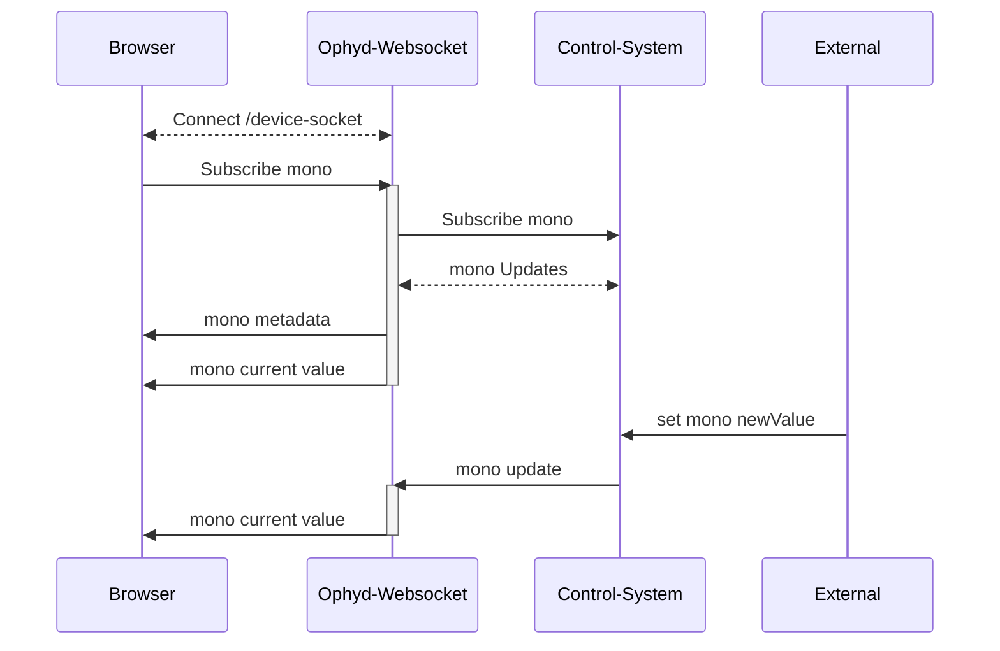
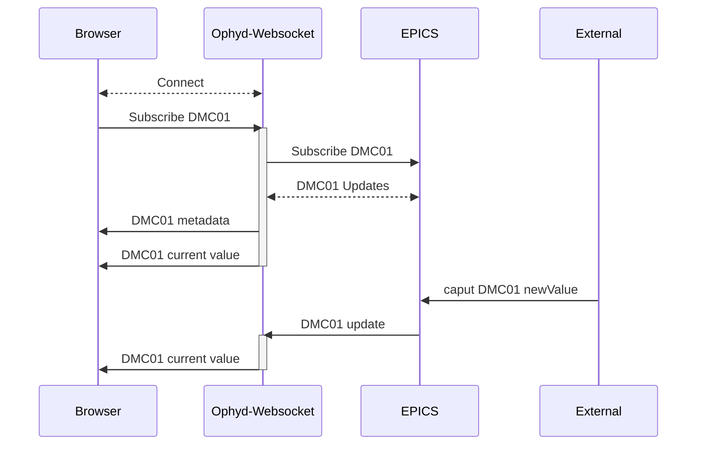

# ophyd-websocket
Experimental python based websocket server used to live-monitor and set ophyd device values through a web browser.

## Use Case 
If you are building a web browser application and need to:
* Monitor the current value of an Ophyd device
* Set the value of a device
* Know immediately when a device disconnects/reconnects 

then ophyd-websocket can provide these features.

## How it works

Clients first instantiate a connection to the desired websocket path, then send a message through the websocket with the name of a device. The python server running the websocket uses Ophyd to subscribe callbacks to that device, which then trigger messages back to the client whenever the status of the device changes. This includes the device connecting/reconnecting and changes in value. Through the same websocket, a client may also send a message to change the value of the device.

Ophyd async is not currently supported.

A single websocket instance can hold any number of device subscriptions.

## Developing against simulated hardware

For running the project locally against a simulated beamline — the docker
compose test stack, the simulated IOCs, the ophyd devices, and the frontend —
see [DEVELOPMENT.md](DEVELOPMENT.md).

# Installation
```bash
pip install ophyd-websocket
```

# Starting the Server

```bash
ophyd-websocket
```

With custom host and port:
```bash
OAS_PORT=8001 OAS_HOST=0.0.0.0 ophyd-websocket
```

# Using device-socket for Ophyd devices
## Startup Directory
Any use of the device-socket path will require the server to start with a startup directory.
```bash
ophyd-websocket --startup-dir /path/to/devices.py
```

By default, when the server starts up it will try to instantiate the Ophyd devices. If the startup files change, reload the devices by making a POST request to /api/v1/load-devices.

```bash
curl -X 'POST' \
  'http://localhost:8001/api/v1/load-devices' \
  -H 'accept: application/json' \
  -d ''
```

## Example - Subscribing to a device
Example JSON message to ws://localhost:8001/api/v1/device-socket
```bash
#JSON Message from client to /api/v1/pv-socket
{
    "action": "subscribe",
    "device": "mono"
}
```

Responses from server over websocket:
```bash
#JSON Messages from /api/v1/device-socket to client

#first message indicates status of subscription attempt
{
    "message": "Subscribed to mono"
}
#second message is the current value (sent every time value changes)
{
    "device": "mono",
    "value": 0.0,
    "timestamp": 1759256744.247916,
    "connected": true,
    "read_access": true,
    "write_access": true
}
#optional third message is the connection information (only sent on connect/disconnect for certain Ophyd devices)
{
    "connected": true,
    "read_access": true,
    "write_access": true,
    "timestamp": 1759256744.247916,
    "status": 0,
    "severity": 0,
    "precision": 5,
    "setpoint_timestamp": null,
    "setpoint_status": null,
    "setpoint_severity": null,
    "lower_ctrl_limit": -100.0,
    "upper_ctrl_limit": 100.0,
    "units": "degrees",
    "enum_strs": null,
    "setpoint_precision": null,
    "sub_type": "meta",
    "obj": "IOC:m1",
    "device": "IOC:m1"
}
```

JSON message client to /api/v1/pv-socket
```bash
#JSON Message from client to /api/v1/device-socket
{
    "action": "set",
    "device": "mono",
    "value": 10
}
```
Responses from server over websocket:

```bash
#JSON Message from /api/v1/device-socket to client
{
    "device": "mono",
    "value": 10,
    "timestamp": 1759259117.565635,
    "connected": true,
    "read_access": true,
    "write_access": true
}
```

# Messages and Responses


# WebSocket Endpoints

## device-socket vs pv-socket

The server provides two different WebSocket endpoints for monitoring and controlling devices:

- **`/api/v1/device-socket`** - For Ophyd devices from the device registry
- **`/api/v1/pv-socket`** - For direct EPICS PV connections

### Key Differences:

| Feature | device-socket | pv-socket |
|---------|---------------|-----------|
| **Data Source** | Device registry (requires startup files) | Direct EPICS PV connections |
| **Configuration** | Requires `--startup-dir` or device loading | No configuration needed |
| **Device Types** | Complex Ophyd devices (EpicsMotor, custom devices) | Individual EPICS PVs |
| **Message Format** | `{"device": "motor1"}` | `{"pv": "IOC:m1"}` |
| **Metadata** | Full device info including components | Basic PV metadata |
| **Connection Handling** | Aggregated connection state for multi-signal devices | Individual PV connection state |

## Using device-socket for Ophyd Devices

The `/api/v1/device-socket` endpoint works with devices loaded into the device registry from startup files. It supports complex Ophyd devices like EpicsMotor, custom Device classes, and PseudoPositioners.

### Available Actions

#### subscribe
Subscribe to real-time updates from a device in the registry.
```json
{
    "action": "subscribe",
    "device": "motor1"
}
```

Subscribe to multiple devices in a single message using the `devices` key:
```json
{
    "action": "subscribe",
    "devices": ["motor1", "motor2", "detector1"]
}
```

The server responds with a summary for multi-device subscriptions:
```json
{
    "action": "subscribe",
    "subscribed": ["motor1", "motor2"],
    "already_subscribed": ["detector1"],
    "failed": []
}
```

#### subscribeSafely
Subscribe only if the device can be successfully connected to. Supports both single and multiple devices.
```json
{
    "action": "subscribeSafely", 
    "device": "motor1"
}
```
```json
{
    "action": "subscribeSafely",
    "devices": ["motor1", "motor2"]
}
```

#### unsubscribe
Stop receiving updates from a device. Supports both single and multiple devices.
```json
{
    "action": "unsubscribe",
    "device": "motor1"
}
```
```json
{
    "action": "unsubscribe",
    "devices": ["motor1", "motor2"]
}
```

The server responds with a summary:
```json
{
    "action": "unsubscribe",
    "unsubscribed": ["motor1", "motor2"],
    "not_subscribed": []
}
```

#### set
Set a value on a device.
```json
{
    "action": "set",
    "device": "motor1",
    "value": 5.0,
    "timeout": 2.0
}
```

#### refresh
Trigger a read of all subscribed devices.
```json
{
    "action": "refresh"
}
```

### Response Format
Device-socket responses include information about the specific signal within multi-component devices:
```json
{
    "device": "motor1",
    "signal": "motor1_user_readback",
    "value": 5.0,
    "timestamp": 1759256744.247916,
    "connected": true,
    "read_access": true,
    "write_access": true
}
```

## Using pv-socket for EPICS PVs

The `/api/v1/pv-socket` endpoint can be used for subscribing to individual EPICS PVs through Ophyd. This method does not require any configuration files or startup directory.

### Available Actions

#### subscribe
Subscribe to any EPICS PV (creates connection if it doesn't exist).
```json
{
    "action": "subscribe",
    "pv": "IOC:m1"
}
```

Subscribe to multiple PVs in a single message using the `pvs` key:
```json
{
    "action": "subscribe",
    "pvs": ["IOC:m1", "IOC:m2", "IOC:m3"]
}
```

The server responds with a summary for multi-PV subscriptions:
```json
{
    "action": "subscribe",
    "subscribed": ["IOC:m1", "IOC:m2"],
    "already_subscribed": ["IOC:m3"],
    "failed": []
}
```

#### subscribeSafely
Subscribe only if the PV can be successfully connected to. Supports both single and multiple PVs.
```json
{
    "action": "subscribeSafely",
    "pv": "IOC:m1"
}
```
```json
{
    "action": "subscribeSafely",
    "pvs": ["IOC:m1", "IOC:m2"]
}
```

#### subscribeReadOnly
Subscribe to a PV in read-only mode.
```json
{
    "action": "subscribeReadOnly",
    "pv": "IOC:m1"
}
```

#### unsubscribe
Stop receiving updates from a PV. Supports both single and multiple PVs.
```json
{
    "action": "unsubscribe", 
    "pv": "IOC:m1"
}
```
```json
{
    "action": "unsubscribe",
    "pvs": ["IOC:m1", "IOC:m2"]
}
```

The server responds with a summary:
```json
{
    "action": "unsubscribe",
    "unsubscribed": ["IOC:m1", "IOC:m2"],
    "not_subscribed": []
}
```

#### set
Set a value on a PV (includes limit checking).
```json
{
    "action": "set",
    "pv": "IOC:m1",
    "value": 5.0,
    "timeout": 2.0
}
```

#### refresh
Trigger a read of all subscribed PVs.
```json
{
    "action": "refresh"
}
```

### Response Format
PV-socket responses focus on individual PV information:
```json
{
    "pv": "IOC:m1",
    "value": 0.0,
    "timestamp": 1759256744.247916,
    "connected": true,
    "read_access": true,
    "write_access": true
}
```

## Action Comparison

| Action | device-socket | pv-socket | Key Differences |
|--------|---------------|-----------|-----------------|
| **subscribe** | ✅ Subscribe to device(s) from registry | ✅ Subscribe to any EPICS PV(s) | Use `"device"`/`"devices"` for device-socket; `"pv"`/`"pvs"` for pv-socket |
| **subscribeSafely** | ✅ Subscribe with connection validation | ✅ Subscribe with connection validation | Both support single or multiple targets |
| **subscribeReadOnly** | ❌ Not available | ✅ Read-only subscription | Only pv-socket supports explicit read-only mode (currently) |
| **unsubscribe** | ✅ Stop device updates (single or multiple) | ✅ Stop PV updates (single or multiple) | Use `"device"`/`"devices"` or `"pv"`/`"pvs"` |
| **set** | ✅ Set device value | ✅ Set PV value | Device-socket may target complex devices; pv-socket targets individual PVs |
| **refresh** | ✅ Refresh all subscribed devices | ✅ Refresh all subscribed PVs | Device-socket may refresh multiple signals per device |

### When to Use Each Endpoint

**Use `/api/v1/device-socket` when:**
- Working with complex Ophyd devices (EpicsMotor, custom Device classes)
- You have startup files defining your device configuration
- You need coordinated control of multi-component devices
- You want centralized device management through the registry

**Use `/api/v1/pv-socket` when:**
- Working with individual EPICS PVs
- You don't have device configuration files
- You need quick access to any PV without setup


# Messages and Responses


# Experimental Features
In addition to subscribing to devices and setting their values, there are some additional experimental websockets and REST API endpoints available in this project.

## "Ophyd as a Service" REST API
After starting the server navigate to [http://localhost:8001/docs](http://localhost:8001/docs) to see endpoints and try out functionality. 

### Configuration Parameters

The server can be configured using environment variables or command line arguments:

#### OAS (Ophyd as a Service) Configuration

| Parameter | Environment Variable | Default | Description |
|-----------|---------------------|---------|-------------|
| Host | `OAS_HOST` | `localhost` | Server host address |
| Port | `OAS_PORT` | `8001` | Server port number |
| Startup Directory | `OAS_STARTUP_DIR` | None | Path to directory containing device definition files |
| Require Queue Server | `OAS_REQUIRE_QSERVER` | `false` | Whether queue server safety checks are enforced |
| Allowed Origins | `OAS_ALLOWED_ORIGINS` | None | Additional CORS origins (comma-separated) |
| Host | `OAS_LOG_LEVEL` | `INFO` | Log level |

#### Queue Server Configuration
The REST API endpoints for setting values of devices can optionally first check if the Queue Server is active and reject requests if a plan is running. This feature is currently only available on the REST endpoints, not the websockets, but is planned to be added to websockets.
| Parameter | Environment Variable | Default | Description |
|-----------|---------------------|---------|-------------|
| Host | `QSERVER_HTTP_SERVER_HOST` | `localhost` | Queue server HTTP API host |
| Port | `QSERVER_HTTP_SERVER_PORT` | `60610` | Queue server HTTP API port |
| API Key | `QSERVER_HTTP_SERVER_SINGLE_USER_API_KEY` | `test` | Authentication key for queue server |

#### EPICS Configuration
If you are using EPICS as the underlying controls system, ensure that you have proper environment variables set.
| Parameter | Environment Variable | Description |
|-----------|---------------------|-------------|
| Address List | `EPICS_CA_ADDR_LIST` | Space-separated list of EPICS CA gateway addresses |
| Auto Address List | `EPICS_CA_AUTO_ADDR_LIST` | Enable/disable automatic address list discovery |
| Max Array Bytes | `EPICS_CA_MAX_ARRAY_BYTES` | Maximum size for EPICS array transfers |

#### Example Usage

```bash
# Using environment variables
export OAS_HOST=0.0.0.0
export OAS_PORT=8001
export OAS_STARTUP_DIR=/path/to/devices
export QSERVER_HTTP_SERVER_HOST=queue-server.local
ophyd-websocket

# Using command line arguments
ophyd-websocket --startup-dir /path/to/devices.py

# Using both (environment variables take precedence)
OAS_PORT=8002 ophyd-websocket --startup-dir /path/to/devices
```

### Device Loading

You can load up predefined Ophyd devices with a POST request to `http://localhost:8001/api/v1/load-devices`.

These predefined Ophyd devices should live in any python file that can be accessed during server startup. Pass a `--startup-dir` arg to the server with your file or folder.

```bash
ophyd-websocket --startup-dir /path/to/devices.py
```
Then in your python file instantiate your Ophyd devices, which will then be available when making API calls or websocket subscriptions to devices.

```python
#/path/to/devices.py
from ophyd import EpicsSignal, EpicsMotor, Device, Component

# Simple EPICS signals - these will be detected and added to registry
sim_motor1 = EpicsSignal("IOC:m1", name="motor1")
sim_motor2 = EpicsMotor("IOC:m2", name="motor2")
# Custom Ophyd Device class
class SimpleMotor(Device):
    """A simple motor device with position and velocity"""
    m1 = Component(EpicsSignal, "m1")
    m2 = Component(EpicsSignal, "m2")

sim_motor_device = SimpleMotor("IOC:", name="sim_motor_device")
```


## Stream Queue Server Console Output

**Socket Endpoint:** `/api/v1/qs-console-socket`

The Queue Server Console Output WebSocket provides real-time streaming of console output from the Bluesky Queue Server. This is useful for monitoring queue server operations, plan execution status, and debugging queue server issues.

### How It Works

The WebSocket endpoint acts as a bridge between the Queue Server's ZeroMQ (ZMQ) console output and WebSocket clients. It:

1. **Connects to Queue Server ZMQ**: Establishes a ZMQ SUB (subscriber) socket connection to the queue server's console output stream
2. **Filters Messages**: Receives all console messages and filters out internal "QS_Console" heartbeat messages
3. **Streams to Clients**: Forwards relevant console output to connected WebSocket clients in real-time

### Configuration

The connection to the Queue Server is configured via environment variables:

| Environment Variable | Default | Description |
|---------------------|---------|-------------|
| `ZMQ_HOST` | `localhost` | Hostname where the Queue Server ZMQ console is running |
| `ZMQ_PORT` | `60625` | Port for the Queue Server ZMQ console output |

### Usage Example
Javascript Client
```javascript
// Connect to the queue server console stream
const ws = new WebSocket('ws://localhost:8001/api/v1/qs-console-socket');

ws.onopen = function() {
    console.log('Connected to Queue Server console');
};

ws.onmessage = function(event) {
    // Real-time console output from the queue server
    console.log('Queue Server:', event.data);
    
    // Display in your application's console/log area
    document.getElementById('console-output').innerHTML += event.data + '\n';
};

ws.onclose = function() {
    console.log('Queue Server console connection closed');
};
```

### What You'll See

The console output includes various types of messages from the queue server:

- **Plan Execution**: Start/stop/pause/resume notifications
- **Device Status**: Motor movements, detector readings
- **Error Messages**: Plan failures, device connection issues
- **Queue Status**: Items added/removed from the queue
- **User Commands**: RE manager commands and responses

### Example Console Output

```
2024-02-06 10:30:15 - INFO - Queue Server: Starting plan 'count'...
2024-02-06 10:30:16 - INFO - Queue Server: Moving motor 'x_motor' to position 5.0
2024-02-06 10:30:17 - INFO - Queue Server: Detector 'det1' reading: 1234.56
2024-02-06 10:30:18 - INFO - Queue Server: Plan 'count' completed successfully
2024-02-06 10:30:19 - INFO - Queue Server: Queue empty
```

### Troubleshooting

**Connection Issues:**
- Verify `ZMQ_HOST` and `ZMQ_PORT` environment variables
- Check that the Queue Server is running and ZMQ console is enabled
- Ensure firewall allows connections to the ZMQ port

**No Messages Received:**
- Queue Server may be idle (no plans running)
- Check Queue Server configuration for console output settings
- Verify ZMQ console is properly configured in the Queue Server with `start-re-manager --zmq-publish-console ON`

## Stream Area Detector Images

**Socket Endpoint:** `/api/v1/camera-socket`

The Camera Socket WebSocket provides real-time streaming of images from EPICS Area Detector devices. It converts raw detector array data into JPEG images and streams them to web clients for live visualization.

### How It Works

The WebSocket endpoint:

1. **Connects to Area Detector PVs**: Subscribes to image array data and detector settings (size, color mode, data type)
2. **Processes Raw Data**: Converts EPICS array data into proper image formats with normalization
3. **Streams JPEG Images**: Encodes processed images as JPEG and sends binary data to WebSocket clients
4. **Dynamic Configuration**: Automatically adjusts to detector settings changes (image dimensions, data types)

### Configuration

The camera socket requires configuration of Area Detector PVs on connection. You can provide:

- **Image Array PV**: The main PV containing image data (e.g., `IOC:image1:ArrayData`)
- **Settings PVs**: Individual PVs for image dimensions and properties
- **Prefix**: A common prefix to auto-generate PV names

### Connection Message

Send an initialization message when connecting to specify the detector configuration:

```javascript
{
    "imageArray_PV": "13SIM1:image1:ArrayData",  // Main image data PV
    "startX": "13SIM1:cam1:MinX",                // Image region start X
    "startY": "13SIM1:cam1:MinY",                // Image region start Y  
    "sizeX": "13SIM1:cam1:SizeX",                // Image width
    "sizeY": "13SIM1:cam1:SizeY",                // Image height
    "colorMode": "13SIM1:cam1:ColorMode",        // Color mode (Mono, RGB1, RGB2, RGB3)
    "dataType": "13SIM1:cam1:DataType"           // Data type (UInt8, UInt16, etc.)
}
```

### Usage Example

```javascript
// Connect to the camera stream
const ws = new WebSocket('ws://localhost:8001/api/v1/camera-socket');

// Create canvas for image display
const canvas = document.getElementById('camera-canvas');
const context = canvas.getContext('2d');

ws.onopen = function() {
    console.log('Connected to camera stream');
    
    // Send configuration for Area Detector
    const config = {
        imageArray_PV: "13SIM1:image1:ArrayData",
        startX: "13SIM1:cam1:MinX",
        startY: "13SIM1:cam1:MinY", 
        sizeX: "13SIM1:cam1:SizeX",
        sizeY: "13SIM1:cam1:SizeY",
        colorMode: "13SIM1:cam1:ColorMode",
        dataType: "13SIM1:cam1:DataType"
    };
    ws.send(JSON.stringify(config));
};

ws.onmessage = async function(event) {
    if (typeof event.data === "string") {
        // Configuration/settings updates
        const settings = JSON.parse(event.data);
        console.log('Camera settings:', settings);
        
        // Update canvas size if needed
        if (settings.x && settings.y) {
            canvas.width = settings.x;
            canvas.height = settings.y;
        }
    } else {
        // Binary image data (JPEG)
        try {
            //NOTE: there are many ways to display an image in the browser, this is just one example
            const blob = new Blob([event.data], { type: 'image/jpeg' });
            const imageBitmap = await createImageBitmap(blob);
            
            // Draw image to canvas
            context.clearRect(0, 0, canvas.width, canvas.height);
            context.drawImage(imageBitmap, 0, 0, canvas.width, canvas.height);
        } catch (error) {
            console.error('Error displaying image:', error);
        }
    }
};

// Optional: Toggle logarithmic normalization
function toggleLogNormalization(enabled) {
    const message = { toggleLogNormalization: enabled };
    ws.send(JSON.stringify(message));
}

ws.onclose = function() {
    console.log('Camera stream connection closed');
};
```

### Message Types

#### Outgoing (Client → Server)

**Initial Configuration:**
```javascript
{
    "imageArray_PV": "IOC:image1:ArrayData",
    "sizeX": "IOC:cam1:SizeX",
    "sizeY": "IOC:cam1:SizeY",
    // ... other detector PVs
}
```

**Toggle Log Normalization:**
```javascript
{
    "toggleLogNormalization": true  // or false
}
```

#### Incoming (Server → Client)

**Image Settings Updates (JSON):**
```javascript
{
    "x": 1024,              // Image width
    "y": 768,               // Image height
    "colorMode": "Mono",    // Color mode
    "dataType": "UInt16"    // Data type
}
```

**Log Normalization Status:**
```javascript
{
    "logNormalization": true
}
```

**Image Data (Binary):** Raw JPEG binary data for display

### Features

- **Multiple Color Modes**: Supports Mono, RGB1, RGB2, RGB3 formats
- **Data Type Flexibility**: Handles various detector data types (UInt8, UInt16, Int32, Float32, etc.)
- **Normalization Options**: Linear or logarithmic intensity normalization
- **Real-time Settings**: Responds to detector configuration changes automatically

### Default Configuration

If no configuration is provided, defaults to ADSimDetector PVs:
- Image Array: `13SIM1:image1:ArrayData`
- Camera Settings: `13SIM1:cam1:*` PVs

### Tips

If using this for a GigE camera (or other non-detector camera used to live stream) it is recommended to enable binning on the EPICS device to lower the processing demands.

This socket is not recommended for use with true Xray detectors, as the large array sizes can have performance issues when being processed on the client side. If you need to display the most recent detector image, consider instead loading up the saved detector file once it's available. Examples of this are available in finch.

# Docker setup
```bash
docker build -t ophyd-websocket . 
docker run -p 8001:8001 ophyd-websocket
```

# Development

For building from source, running against simulated hardware, and the docker
compose test stack, see [DEVELOPMENT.md](DEVELOPMENT.md).
