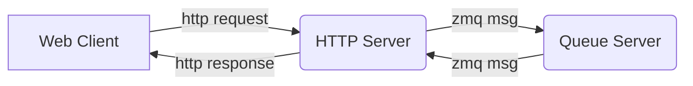

# Queue Server API (Bluesky HTTP Server)
This folder contains a dockerfile for running the Queue Server API (also named the Bluesky HTTP server in official documentation). This API provides necessary endpoints for controlling the Queue Server from a web browser client.

## Install
[HTTP Server Documentation](https://blueskyproject.io/bluesky-httpserver/installation.html)


The HTTP server is part of the Queue Server system and works directly with the Queue Server.

<mark>Optional: Create python environment</mark>
```bash
conda create -n queue_server python=3.10
activate queue_server
```

<mark>Install HTTP Server </mark>
```bash
pip install bluesky-httpserver
```
Note that conda does not work for installing http server on Mac M2.

## Run
<mark>Start HTTP Server with key 'test'</mark>

The API KEY provided will be needed by a web client when making requests.
```bash
QSERVER_HTTP_SERVER_SINGLE_USER_API_KEY=test QSERVER_HTTP_SERVER_ALLOW_ORIGINS=http://localhost:5173 uvicorn --host localhost --port 60610 bluesky_httpserver.server:app
```

Navigate to [http://localhost:60610/docs](http://localhost:60610/docs)


## How it works
The http server is a part of the queue server, it acts as a gateway to control the queue server. The queue server itself only communicates over ZMQ, so the http server acts as an API for web clients which otherwise cannot command the queue server directly. The http server is typically hosted on port 60610.

